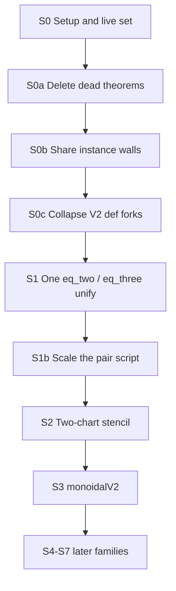

# Unification roadmap

Two deliverables in one change: (1) the repo becomes clone-complete for planning work, (2) the unification walkthrough lives in git as a standing plan.

Keep [`sources/unification-opportunities.md`](sources/unification-opportunities.md) as the raw count list. Do not delete theorems, unify Lean, or rebuild FLT in this change.

## Clone-complete archive (new requirement)

A `git clone` of the last pushed commit on another PC must be enough to continue this work. Cursor’s copies are local and do not travel:

- Chats / transcripts: `~/.cursor/projects/home-catskills-Desktop-flt-compression/agent-transcripts/`
- Plans at inception: [`/home/catskills/.cursor/plans/*.plan.md`](/home/catskills/.cursor/plans/) (machine-wide; 100+ files from other repos)
- Sometimes moved to the workspace: `.cursor/plans/`

**This repo only.** Copy plans that belong to *flt-compression*, never the Scott / DIII-D / Palomar / … files in the same folder. Match by content (paths like `flt-compression`, `vendor/fermats-last-theorem`, `unification-opportunities`, `FinalCheck`) or by being created in this workspace. Right now that is [`unification_roadmap_d3e19f46.plan.md`](/home/catskills/.cursor/plans/unification_roadmap_d3e19f46.plan.md). Copy drafts and superseded versions too if they are this project’s.

Layout after the change:

- [`notes/plans/cursor/`](notes/plans/cursor/) — verbatim Cursor `.plan.md` files, **keep the original slug+hash filename** so later saves can overwrite the same id
- [`notes/plans/unification-roadmap.md`](notes/plans/unification-roadmap.md) — human walkthrough you step through
- [`notes/chats/`](notes/chats/) — session decisions
- [`sources/`](sources/) — inventory and images
- [`.cursor/rules/preserve-project-notes.mdc`](.cursor/rules/preserve-project-notes.mdc) — agent habit

On **“save the chat”** the agent must, in order:

1. Write or append `notes/chats/YYYY-MM-DD-short-slug.md`.
2. Scan `~/.cursor/plans/` and the workspace `.cursor/plans/` for **this project’s** `.plan.md` files (including temporary ones). Copy new or changed files into `notes/plans/cursor/`.
3. Update standing plans under `notes/plans/` if the session changed them.
4. Commit and **push** (clone-of-HEAD is the bar).

What a clone still will not have (and we do not vendor): Lean/`lake` build cache, Mathlib checkout under `.lake`, or Cursor’s local UI transcripts. Those can be rebuilt. Planning state cannot.

## How the walkthrough is structured

Every step in the written plan will have the same fields so you can stop between them:

- **Goal** — one outcome
- **Open** — concrete paths under [`vendor/fermats-last-theorem`](vendor/fermats-last-theorem)
- **Do** — the work
- **Done when** — a check you can run or a file you can commit
- **Stop if** — hypotheses differ in a paper-shaped way
- **Do not** — cream / landmarks / frozen vendor

Global acceptance, repeated at the end of every Lean-editing step:

```lean
#print axioms fermat_last_theorem
-- propext, Classical.choice, Quot.sound
```

via [`vendor/fermats-last-theorem/FinalCheck.lean`](vendor/fermats-last-theorem/FinalCheck.lean). A full `lake build FinalCheck` is the gate for a phase, not for every file skim.



## Ground rules the plan will lock

- **Cream stays.** Paper nouns and predicates (`Place`, `Pic0`, `IsModular`, Frey curve, Néron model, Igusa, Drinfeld, fake elliptic curve). Unused *fields* of those structures may still go.
- **Residue and bookkeeping only.** `*Datum` / `*Input` / `*Package` / generated `attribute [-instance]` walls / private lemma clones.
- **Vendor is frozen.** [`vendor/FROZEN.txt`](vendor/FROZEN.txt) pin `aa2d8b34`. Inventory scripts may read it. Lean edits belong in a working tree decided in S0, not silent mutation of vendor.
- **Theorems are wrappers.** A `Thm_*.lean` file is mostly instance-disable walls plus `p2m_exact_reverting` into `P2M/Sol/S_*.lean`. Unifying a statement means unifying the Sol proof too.
- **Do not merge** landmark theorems, or Fake-elliptic × X1(p) × DR into one type. Same chart lemmas, different moduli problems.

## What each step in the written plan will say

### S0 — Setup (no Lean edits)

Decide the working tree (recommendation: keep vendor read-only; put scripts in `scripts/`; copy or overlay only when a later step starts editing). Write a small import-walker from [`FinalCheck.lean`](vendor/fermats-last-theorem/FinalCheck.lean) (`import Theorems.Thm_fermat_last_theorem`). Record baseline counts next to the inventory (29,511 theorems, 1,450 `Def_` modules).

**Done when:** live-set list exists (every `Thm_` / `Def_` / `P2M/Sol` file in the import closure) and a short “how we measure” note is in the plan file or `sources/`.

### S0a — Delete the 22 theorems outside the citation closure

Mechanical. Drop anything `FinalCheck` does not import. Rebuild if a working tree exists; otherwise just commit the kill list.

**Done when:** named list of the 22 (html docs said 19 uncited) and they are gone from the live set.

Skip unused citation edges (2.7%) until after S1. Many are instances/notation, not dead imports.

### S0b — One shared instance-disable wall

Largest *textual* factor. Every theorem starts with pages of `attribute [-instance]` (see the first 30+ lines of [`Theorems/Thm_GaloisRep_exists_stableLine_of_theta_T_ne_zero_of_det_eq_pow_of_eq_two.lean`](vendor/fermats-last-theorem/Theorems/Thm_GaloisRep_exists_stableLine_of_theta_T_ne_zero_of_det_eq_pow_of_eq_two.lean) and [`Thm_fermat_last_theorem.lean`](vendor/fermats-last-theorem/Theorems/Thm_fermat_last_theorem.lean)).

**Do:** extract one shared disable module (or scoped `set_option`); replace two files first, then scale.

**Done when:** those two files shrink and still compile. Do not wait for all 29k.

### S0c — V2 / V4 / NoBT1 definition forks (33 modules)

Example pair: [`Definitions/Def_HeckeGalois_MazurCase1Bundle.lean`](vendor/fermats-last-theorem/Definitions/Def_HeckeGalois_MazurCase1Bundle.lean) vs [`…MazurCase1BundleNoBT1.lean`](vendor/fermats-last-theorem/Definitions/Def_HeckeGalois_MazurCase1BundleNoBT1.lean). Keep one interface; re-prove the other as an `abbrev` if callers need the old name.

**Stop if** the BT1 flag changes a hypothesis a paper would keep.

### S1 — First unify (the 30–60 minute experiment)

Open this pair (names are *not* a blind `_eq_two` / `_eq_three` rename):

- Two: [`Theorems/Thm_GaloisRep_exists_stableLine_of_theta_T_ne_zero_of_det_eq_pow_of_eq_two.lean`](vendor/fermats-last-theorem/Theorems/Thm_GaloisRep_exists_stableLine_of_theta_T_ne_zero_of_det_eq_pow_of_eq_two.lean) — extra `k = 2`
- Three: [`Theorems/Thm_GaloisRep_exists_stableLine_of_theta_T_ne_zero_of_det_eq_pow_of_three_le_of_eq_three.lean`](vendor/fermats-last-theorem/Theorems/Thm_GaloisRep_exists_stableLine_of_theta_T_ne_zero_of_det_eq_pow_of_three_le_of_eq_three.lean) — `p = 3` and `2 ≤ k ≤ p+1`
- Wrapper Sol: [`P2M/Sol/S_GaloisRep_exists_stableLine_of_theta_T_ne_zero_of_det_eq_pow_of_eq_three.lean`](vendor/fermats-last-theorem/P2M/Sol/S_GaloisRep_exists_stableLine_of_theta_T_ne_zero_of_det_eq_pow_of_eq_three.lean)

**Do:** one parameterized statement; specialize both ways; do not touch cream (`heckeAlgebra`, residual `ρ`, Hecke `T`).

**Done when:** both specializations compile. **Then** skim one `FullLevel.Diamond.AuxLevel` pair before scripting the other ~250 name pairs. **Stop if** more pairs have the `k = 2` vs `2 ≤ k ≤ p+1` split — parameterize, do not rename.

Nearby same pattern, later: `_of_five_le` (61), `_finrank_eq_two` (77).

### S2 — Two-chart stencil (after S1 works)

Cream is already named: [`Definitions/Def_AlgebraicCurve_TwoChartIntegralModel.lean`](vendor/fermats-last-theorem/Definitions/Def_AlgebraicCurve_TwoChartIntegralModel.lean) (`fInf` / `ιInf` / `fFin` / `ιFin`). Residue is the per-package lemma clones on PlaceSpecialization (704), XHDR (313), DRModelPackage (274), XOneP (264), Igusa (132), TwoChartIntegralModel (127).

**Do:** prove `isOpenImmersion_fInf` (and two siblings) once against that interface; instantiate; do not smash DR / X1(p) / Igusa into one moduli type. `V3Glue.ChartInput` is the same idea one layer down.

### S3 — `monoidalV2` (68 twins)

API fork in `AlgebraicGeometry.Scheme.Modules.IsInvertible_*`. One statement; `abbrev` if both spellings must stay. Related defs: `SheafOfModules_MonoidalV2`.

### S4–S7 — queued, not next

Same template, later sittings: 61 `exists_fg_subalgebra_*`; 66 `SmallExtension` cocycle dialects; J₀ Néron `*Data` wrappers (cream = Néron of \(J_0(N)\)); 37 `heckeLocal` + the two Wiles lifting cases. Fake-elliptic (741) last — typeclass fight.

## What this change will not do

Rebuild the 1.6 GB tree, or execute S0a–S1. After this lands, another PC that clones `main` should have the walkthrough, the raw Cursor plan, the chat note, the save habit, and the vendor pin — enough to start at S0.
