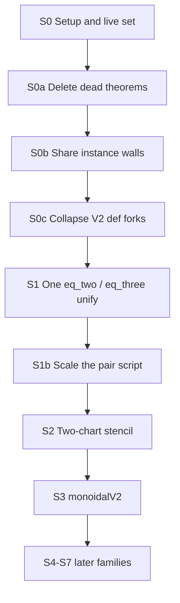

# Unification roadmap

Standing walkthrough for residue unification. Raw counts stay in
[`sources/unification-opportunities.md`](../../sources/unification-opportunities.md).
Cursor draft: [`cursor/unification_roadmap_d3e19f46.plan.md`](cursor/unification_roadmap_d3e19f46.plan.md).

Vendor pin `aa2d8b34` in [`vendor/FROZEN.txt`](../../vendor/FROZEN.txt) is
read-only. The working tree is [`factored/`](../../factored/) — the
`FinalCheck` import closure only (see [`vendor/FACTORED.txt`](../../vendor/FACTORED.txt)).

This file is the plan you step through. It does not itself delete theorems
or rebuild FLT.

## Step template

Every step uses the same fields:

- **Goal** — one outcome
- **Open** — paths under `factored/` (vendor is the frozen reference)
- **Do** — the work
- **Done when** — a check or a file you can commit
- **Stop if** — hypotheses differ in a paper-shaped way
- **Do not** — cream / landmarks / frozen vendor

Global acceptance after every Lean-editing step:

```lean
#print axioms fermat_last_theorem
-- propext, Classical.choice, Quot.sound
```

via [`vendor/fermats-last-theorem/FinalCheck.lean`](../../vendor/fermats-last-theorem/FinalCheck.lean).
A full `lake build FinalCheck` is the gate for a **phase**, not for every file skim.



## Ground rules

- **Cream stays.** Paper nouns and predicates (`Place`, `Pic0`, `IsModular`,
  Frey curve, Néron model, Igusa, Drinfeld, fake elliptic curve). Unused
  *fields* of those structures may still go.
- **Residue and bookkeeping only.** `*Datum` / `*Input` / `*Package` /
  generated `attribute [-instance]` walls / private lemma clones.
- **Vendor is frozen.** Inventory scripts may read it. Do not silently mutate it.
- **Theorems are wrappers.** A `Thm_*.lean` file is mostly instance-disable
  walls plus `p2m_exact_reverting` into `P2M/Sol/S_*.lean`. Unifying a
  statement means unifying the Sol proof too.
- **Do not merge** landmark theorems, or Fake-elliptic × X1(p) × DR into
  one type. Same chart lemmas, different moduli problems.

---

## S0 — Setup (done: working tree is `factored/`)

- **Goal.** A live-set list and a working-tree decision.
- **Open.** [`factored/FinalCheck.lean`](../../factored/FinalCheck.lean)
  (`import Theorems.Thm_fermat_last_theorem`).
- **Do.** Keep vendor read-only. Edit `factored/` only. The live set *is*
  the import closure of `FinalCheck`: 60,475 Lean files (1,450 `Def_`,
  29,511 `Thm_`, 29,513 `P2M`). Html docs, `tools/`, and `.lake/` were
  not copied. Record: [`vendor/FACTORED.txt`](../../vendor/FACTORED.txt).
- **Done when.** `factored/` exists in git and is the tree later steps edit.
- **Do not.** Edit vendor. Copy `html/` or `.lake/`.

## S0a — Delete the 22 theorems outside the citation closure

- **Goal.** Drop anything `FinalCheck` does not import.
- **Open.** The live-set from S0. Html docs said 19 are cited by no proof.
- **Do.** Mechanical kill list. Rebuild only if a working tree exists;
  otherwise commit the list.
- **Done when.** The 22 are named and gone from the live set.
- **Do not.** Chase unused citation edges (2.7%) yet. Many are
  instances/notation, not dead imports. Revisit after S1.

## S0b — One shared instance-disable wall

- **Goal.** Factor the generated `attribute [-instance]` walls.
- **Open.** First 30+ lines of
  [`Theorems/Thm_GaloisRep_exists_stableLine_of_theta_T_ne_zero_of_det_eq_pow_of_eq_two.lean`](../../vendor/fermats-last-theorem/Theorems/Thm_GaloisRep_exists_stableLine_of_theta_T_ne_zero_of_det_eq_pow_of_eq_two.lean)
  and
  [`Theorems/Thm_fermat_last_theorem.lean`](../../vendor/fermats-last-theorem/Theorems/Thm_fermat_last_theorem.lean).
- **Do.** One shared disable module (or scoped `set_option`). Replace
  those two files first, then scale.
- **Done when.** Those two files shrink and still compile.
- **Do not.** Wait for all 29k files before checking the first two.

## S0c — V2 / V4 / NoBT1 definition forks (33 modules)

- **Goal.** One interface per fork; the other name is an `abbrev` if callers need it.
- **Open.**
  [`Definitions/Def_HeckeGalois_MazurCase1Bundle.lean`](../../vendor/fermats-last-theorem/Definitions/Def_HeckeGalois_MazurCase1Bundle.lean)
  vs
  [`Definitions/Def_HeckeGalois_MazurCase1BundleNoBT1.lean`](../../vendor/fermats-last-theorem/Definitions/Def_HeckeGalois_MazurCase1BundleNoBT1.lean).
- **Do.** Keep one; re-prove the other as an abbrev.
- **Stop if.** The BT1 flag changes a hypothesis a paper would keep.
- **Do not.** Merge landmark Mazur *theorems*.

## S1 — First unify (the 30–60 minute experiment)

- **Goal.** One parameterized statement that specializes to both sides of
  one pair.
- **Open.** Names are *not* a blind `_eq_two` / `_eq_three` rename:
  - Two: [`Theorems/Thm_GaloisRep_exists_stableLine_of_theta_T_ne_zero_of_det_eq_pow_of_eq_two.lean`](../../vendor/fermats-last-theorem/Theorems/Thm_GaloisRep_exists_stableLine_of_theta_T_ne_zero_of_det_eq_pow_of_eq_two.lean) — extra `k = 2`
  - Three: [`Theorems/Thm_GaloisRep_exists_stableLine_of_theta_T_ne_zero_of_det_eq_pow_of_three_le_of_eq_three.lean`](../../vendor/fermats-last-theorem/Theorems/Thm_GaloisRep_exists_stableLine_of_theta_T_ne_zero_of_det_eq_pow_of_three_le_of_eq_three.lean) — `p = 3` and `2 ≤ k ≤ p+1`
  - Wrapper Sol: [`P2M/Sol/S_GaloisRep_exists_stableLine_of_theta_T_ne_zero_of_det_eq_pow_of_eq_three.lean`](../../vendor/fermats-last-theorem/P2M/Sol/S_GaloisRep_exists_stableLine_of_theta_T_ne_zero_of_det_eq_pow_of_eq_three.lean)
- **Do.** One lemma in the weight/level; specialize both ways. Unify the
  Sol proof too. Do not touch cream (`heckeAlgebra`, residual `ρ`, Hecke `T`).
- **Done when.** Both specializations compile. Then skim one
  `FullLevel.Diamond.AuxLevel` pair before scripting the other ~250.
- **Stop if.** More pairs have the `k = 2` vs `2 ≤ k ≤ p+1` split —
  parameterize, do not rename.

Nearby same pattern, later: `_of_five_le` (61), `_finrank_eq_two` (77).

## S1b — Scale the pair script

- **Goal.** Apply the S1 pattern to the remaining name pairs (~259).
- **Do.** Script only after S1 and one AuxLevel pair both work.
- **Stop if.** A pair’s hypotheses differ in a way a paper would keep.
- **Do not.** Blind-rename `_eq_two` to a parameter.

## S2 — Two-chart stencil (after S1 works)

- **Goal.** Chart lemmas once; instantiate per package.
- **Open.** Cream is already named:
  [`Definitions/Def_AlgebraicCurve_TwoChartIntegralModel.lean`](../../vendor/fermats-last-theorem/Definitions/Def_AlgebraicCurve_TwoChartIntegralModel.lean)
  (`fInf` / `ιInf` / `fFin` / `ιFin`). Residue counts: PlaceSpecialization
  704, XHDR 313, DRModelPackage 274, XOneP 264, Igusa 132,
  TwoChartIntegralModel 127.
- **Do.** Prove `isOpenImmersion_fInf` (and two siblings) once against
  that interface; instantiate. `V3Glue.ChartInput` is the same idea one
  layer down.
- **Do not.** Smash DR / X1(p) / Igusa into one moduli type.

## S3 — `monoidalV2` (68 twins)

- **Goal.** One statement; `abbrev` if both spellings must stay.
- **Open.** `AlgebraicGeometry.Scheme.Modules.IsInvertible_*`,
  `SheafOfModules_MonoidalV2`.
- **Do.** This is an elaborator/API fork, not two mathematical theorems.
- **Do not.** Change invertible-sheaf cream (`IsInvertible`, frames).

## S4–S7 — queued, not next

Same template, later sittings:

| step | family | cream to keep |
|---|---|---|
| S4 | 61 `exists_fg_subalgebra_*` | fake elliptic curve / QM surface |
| S5 | 66 `SmallExtension` cocycle dialects | `Pic` |
| S6 | J₀ Néron `*Data` wrappers (166) + `RelativeGroupLaw` (417) | Néron of \(J_0(N)\), torsion |
| S7 | 37 `heckeLocal` + two Wiles lifting cases | the two lifting *theorems* as cases of one statement is OK |

Fake-elliptic (741) last — typeclass fight. Unify *after* two-chart work.

## Red lines

- Cream nouns: `FreyPackage` as a *name*, `Place`, `Pic0`, `IsCurveOver`,
  Hecke algebra, deformation ring, Shimura curve.
- Landmark theorems (`Mazur_Frey`, `frey_isModular`, Ribet, LT).
- `FakeEllipticCurve` × `XOneP` × `DRModel` as a single type.
- Any pair whose hypotheses a paper would keep (the `k = 2` vs
  `2 ≤ k ≤ p+1` pair is the warning).
